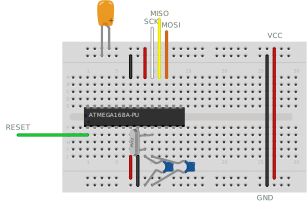

# Programador del Club de Robótica

El club cuenta con varios programadores ISP.

Cada programador cuenta con dos conexiones:
* Target (targ)
    - La conexión más usada. Sirve para programar un microcontrolador externo.
* ISP
    - Sirve para programar el programador (usualmente usando otro programador del club).
      De esta forma un programador sirve para crear más programadores.

## Conexiones

Cada puerto cuenta con 6 pines conectados a un cable plano:

- VCC (usualmente +5V que vienen de la conexión USB)
- GND
- SCK Señal de clock.
- RESET Permite "apagar" el microcontrolador y programarlo por SPI. De esa forma los demás pines pueden ser usados para otras tareas cuando el microcontrolador no está siendo programado.
- MISO (master-in slave-out)<sup>1</sup> Datos del microcontrolador al programador.
- MOSI (master-out slave-in)<sup>1</sup> Datos del programador al microcontrolador.

<sup>1 Nota: SIMO y SOMI suelen ser nombres más simpáticos pero menos usados.</sup>

La ubicación de cada pin en el puerto se muestra a continuación

<p align="center">
    
</p>


## Pequeña guía para programar un microcontrolador externo

Se utiliza el microcontrolador `ATMEGA168A` a modo de ejemplo (ya que el club cuenta con varios).

La siguiente guía asume el uso de un oscilador externo, si bien el microcontrolador puede ser programador utilizando su oscilador interno.

Se conecta al microcontrolador como muestra la siguiente figura. El valor ideal de los capacitores conectados al cristal se detalla en la hoja de datos del microcontrolador. Para este microcontrolador los capacitores recomendados son de 12pF a 22pF. El capacitor de desacople no es requerido pero es siempre una buena idea agregar uno.

<p align="center">
    
</p>

Asumiendo que se utiliza un cristal de 16 MHz se crea un archivo `main.c` con el siguiente código:

```C
#include <avr/io.h>
#define F_CPU 16000000UL  // Corresponde a 16 MHz
#include <util/delay.h>


int main (void) {
  DDRC |= _BV(DDC3);  // Se setea el pin 26 como salida

  while(1) {
      PORTC |= _BV(PC3);  // Se prende el pin 26

      _delay_ms(1); // Se espera un milisegundo

      PORTC &= ~_BV(PC3);  // Se apaga el pin 26

      _delay_ms(1);  // Se espera otro milisegundo
  }

  return 1;
}
```

Este código produce una onda cuadrada de 500Hz a la salida del pin 26.

Para programadorlo se crea el siguiente script `programar.sh`

```bash
#!/usr/bin/env sh

# Compilación del programa
avr-gcc -Os -mmcu=atmega168a -c -o main.o main.c
avr-gcc -Os -mmcu=atmega168a -o main.elf main.o
avr-objcopy -O ihex -R .eeprom main.elf main.hex

# Cargar el programa en el microcontrolador
avrdude -v -p m168 -c usbtiny -U flash:w:main.hex

# Limpieza de los archivos generados
rm main.o main.hex main.elf
```

A su vez se crea un script `fusibles.sh` para setear los fuses del microcontrolador
Si bien se puede obtener el valor de los fusibles a mano, existen páginas que ya hacen este trabajo.
Una posible página es https://www.engbedded.com/fusecalc
Esta página además posee la ventaja de darnos los flags para el comando de `avrdude`.

```bash
#!/usr/bin/env bash

avrdude -v -p m168 -c usbtiny -U lfuse:w:0xce:m -U hfuse:w:0xdf:m -U efuse:w:0xf9:m
```

Se da permiso de ejecución a ambos scripts por única vez
```console
$ chmod +x programar.sh
$ chmod +x fusibles.sh
```

Se setean los fusibles por única vez. Puede correrse también en el futuro si, por ejemplo, se desea dividir la cuenta del clock por 8, o utilizar el oscilador interno u otras razones. Pero ha de tenerse en cuenta que se debe modificar el script.

```console
$ ./fusibles.sh
```

Se programa el microcontrolador

```console
$ ./programar.sh
```

Ahora puede corroborarse que a la salida del pin 26 hay una onda cuadrada de 500Hz.

